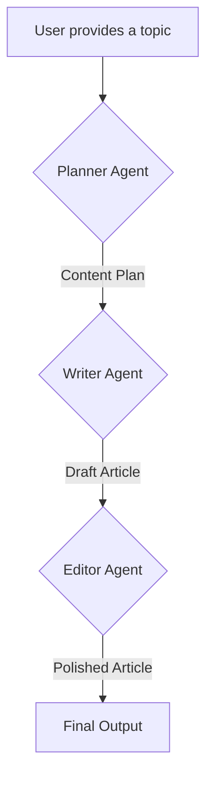

# Multi-Agent Article Writer

This project implements a multi-agent system using the `crewAI` framework to automate the process of researching and writing articles. The system consists of three agents—a Planner, a Writer, and an Editor—that collaborate to generate a well-structured and polished article on a user-provided topic.

## Workflow



## Getting Started

### Prerequisites

* Python 3.x

### Installation

1.  Clone the repository:
    ```sh
    git clone git@github.com:your-username/Multi-Agent-Systems.git
    ```
2.  Install the required libraries:
    ```sh
    pip install -r requirements.txt
    ```

### Configuration

1.  Create a `.env` file in the root directory of the project.
2.  Add your OpenAI API key to the `.env` file:
    ```
    OPENAI_API_KEY=your_openai_key_here
    ```

## Usage

1.  Open the `article_writer-agents.ipynb` notebook in a Jupyter environment.
2.  Run the cells in the notebook to see the agents in action.

## Agents & Tasks

*   **Planner:** This agent is responsible for creating a content plan for the article, including an outline, audience analysis, SEO keywords, and resources.
*   **Writer:** This agent uses the content plan to write the article.
*   **Editor:** This agent proofreads and edits the article for grammar, style, and alignment with the brand's voice.
